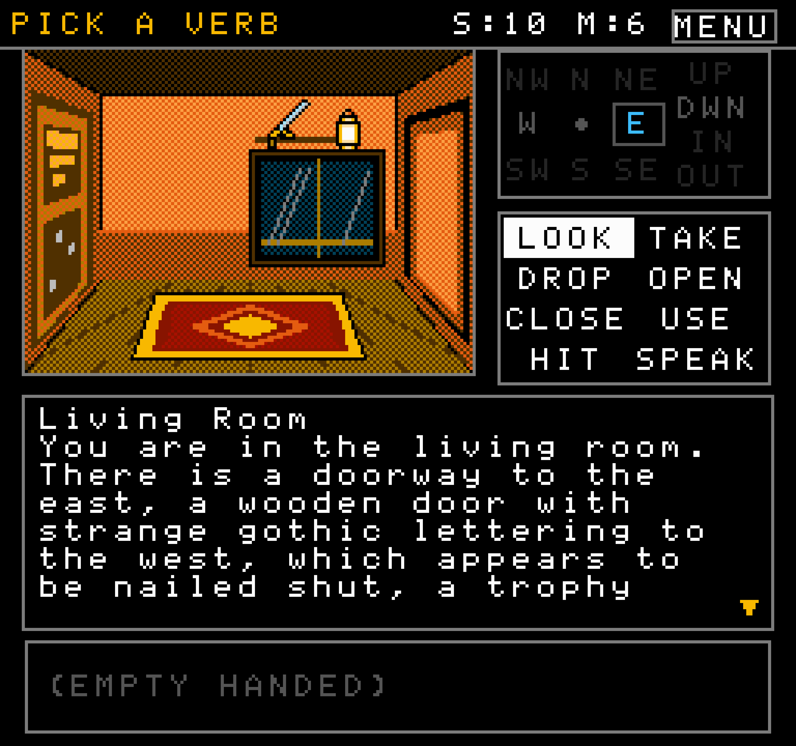
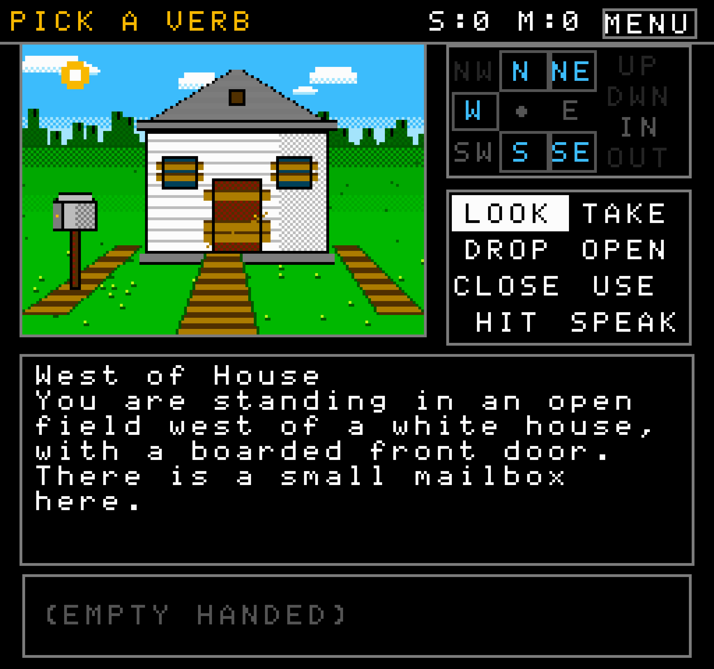
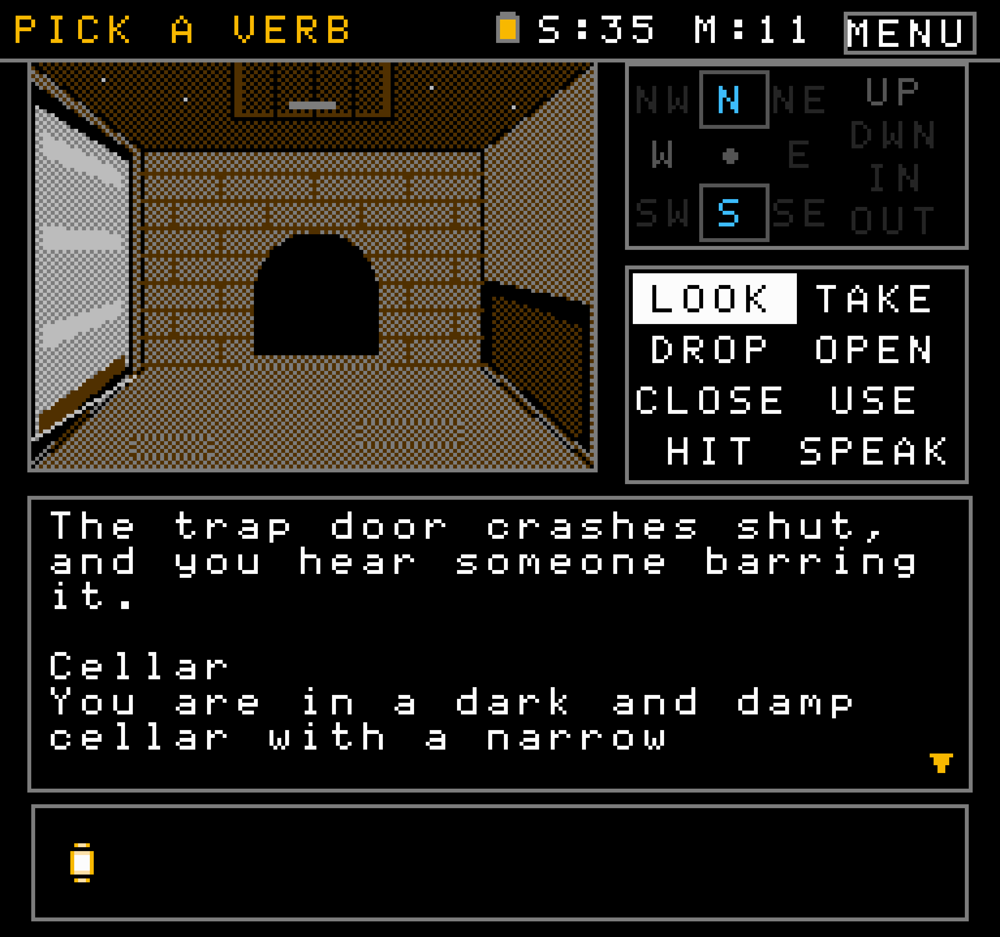

# Folio Game Engine

Old and new adventures, rebuilt as point-and-click games you play in a browser.
A picture of the room, a grid of verbs, a compass, an inventory. Nobody types at
a prompt.



That is Zork I, running its original 1988 story file without modification. The
pictures and the interface are new. The game underneath is the one people played,
down to the parser refusals and the combat rolls.

---

## Where this came from

I was a kid when I first played *Uninvited* and *Déjà Vu* on the NES. Both started
life as Macintosh games, and Kemco ported them to a console with no keyboard, which
meant the parser had to go. What replaced it was a grid of verbs, a cursor, and a
picture of every room. You clicked LOOK, then clicked the thing you wanted to look
at. It worked, and it turned a genre I would probably never have typed my way into
something I could just play.

Zork never got that treatment. Neither did most of interactive fiction, which is
several decades of good writing sitting behind a blinking prompt.

Folio is that treatment, made general. Point it at a classic and it gives the game
pictures and buttons. Point it at a story that was never a game and it builds one.

---

## Try it

```sh
npm i -g folio-engine

folio play  zork-1.folio        # in the terminal
folio info  zork-1.folio        # what is inside
folio validate zork-1.folio     # check it holds up
```

Or open `dist/player-full.html` in a browser and drop a `.folio` onto it.

---

## Zork I as the worked example

Zork is the reference implementation of what a Folio game looks like, and it ships
as a single 218KB file containing the story, every scene, the verb map and its own
walkthrough.

| | |
|---|---|
|  |  |
| The mailbox, the boarded door, the beginning of everything | Below the trap door, where the lamp starts to matter |

The compass shows three states rather than two. A lit direction means you can go, a
dimmed one means the way exists but is blocked, and an absent one means there is no
way at all. The boarded front door reports as blocked rather than missing, so the
player can see the thing they cannot yet use.

---

## What a game is

A `.folio` is a zip with a fixed layout. Everything the game needs is inside it, so
downloading one gives you the whole game and it keeps working without this project.

```
my-game.folio
├── manifest.json            id, title, author, licence, rating, AI disclosure
├── walkthrough.folioscript  required: the proof it can be finished
├── logic/
│   ├── game.z3              a Z-machine story, or
│   └── world.json           a declarative world
├── presentation/            scenes, sprites, verb map, bindings
└── checksums.json           written on pack, verified on load
```

---

## Two logic paths, one contract

| | Path A | Path B |
|---|---|---|
| Runs | An unmodified Z-machine story file | A declarative `world.json` |
| For | Zork, Infocom, modern Inform games | Original stories, compiled sources |
| Referee | The 1988 binary itself | The world interpreter |

Both emit the same **World State Contract**, and that object is the only thing the
renderer reads:

```js
{
  roomId:    "LIVING-ROOM",
  score: 35, moves: 13, dark: false,
  objects:   ["LAMP","SWORD","RUG"],
  inventory: ["LAMP"],
  exits:     { NORTH:"KITCHEN", EAST:false },
  flags:     { LAMP:{ ONBIT:true } }
}
```

The renderer never learns which kind of game produced it, which is how one shell
draws a game from 1988 and a game compiled from a novel last week. A cross-path
parity suite checks that both backends keep speaking it.

A Path B world is data, with no scripting language and a closed vocabulary of
conditions and effects. A `.folio` therefore cannot contain executable code, which
is worth knowing before you open one from a stranger.

---

## Certification

A game is checked before it can claim anything, and each badge covers only what was
actually verified.

| Tier | Proves |
|---|---|
| **T0** schema | The manifest is complete and well-formed |
| **T1** integrity | References resolve, assets decode, capabilities are supported |
| **T2** graph | **No dead ends exist**, computed from the world rather than asserted |
| **T3** replay | **One path completes**, from the opening state, with no state injection |
| **T4** design | Chain depth, item economy, map shape, pacing |

T2 and T3 check different properties and neither implies the other. T3 starts every
run from the game's own beginning, because a test that can teleport the player or
hand them an item only shows that a scene works from a position nobody could reach.
Inform's `TEST ME` allows both, which is why a green run there says less than it
appears to.

**Playable means a path exists. It does not mean a human can find it.** Those are
separate claims, and the badge keeps them separate.

---

## The dials

Difficulty is not one quantity. It is how deep the puzzle chains run, how plainly
clues are stated, how far a key sits from its lock, and how long the game goes
without rewarding you. You state an intent and the compiler resolves the numbers:

```json
{ "length": "epic", "difficulty": "cruel", "deadliness": "classic",
  "sprawl": "open", "density": "balanced" }
```

The numbers come from replaying Zork I and measuring it: 82 rooms, 0.67 loops per
room, a 43% take rate, a reward about every 11.5 moves, and one stretch of 69 moves
with no reward at all. Run `folio profile` on any game to derive its shape.

Two of those measurements changed how the checks work. Most of Zork's world is
scenery by design, so a world where everything is useful reads as a list of tasks
rather than a place. And one loop in a fifty-room map is still a corridor, so map
shape is measured per room instead of in total.

Scale is the exception. Zork has 82 rooms because Zork is Zork, so an adaptation is
measured against its own source rather than against Zork.

---

## Layout

```
packages/
  engine/      the shell, browser reader, player
  zmachine/    Path A backend
  world/       Path B backend
  format/      the .folio container, the contract, the dials
  validator/   T0-T4, the corpus profiler
  cli/         folio
conformance/   fixture games, cross-path parity, the corpus
site/          folio.games
```

```sh
npm test          # both backends, container, validator, parity
npm run build     # the browser player
```

This repository ships no game data. The Path A test suites skip when no story file
is supplied, and say so rather than passing quietly. Point `FOLIO_ORIGIN` at a
checkout containing `data/story.js` and `data/roommap.js` to run them.

---

## The manual

This README is an introduction. The reference manual lives at
[folio.games/docs](https://folio.games/docs/) and is the source of truth: where the
two disagree, the manual is right.

| Page | Covers |
|---|---|
| [Overview](https://folio.games/docs/) | How the pieces fit, and what is built versus designed |
| [Your first game](https://folio.games/docs/quickstart/) | An empty directory to a validated `.folio`, in about ten minutes |
| [Writing a world](https://folio.games/docs/world/) | Every field of `world.json`: rooms, items, rules, ten conditions, fourteen effects |
| [Porting a game](https://folio.games/docs/porting/) | Path A, room maps, and `folio calibrate` |
| [Scenes and verbs](https://folio.games/docs/scenes/) | Drawing rooms, hotspots, sprites, the verb map |
| [Reference](https://folio.games/docs/reference/) | Manifest, folioscript, the CLI, certification tiers, the dials |
| [Finding codes](https://folio.games/docs/errors/) | All 45 validator codes, what causes each and how to fix it |

There is no visual editor. You write JSON and run `folio validate`, and the manual
documents that workflow rather than a tool that does not exist yet.

## Contributing

Folio uses a Developer Certificate of Origin rather than a copyright-assigning CLA,
so `git commit -s` is the whole ceremony and you keep the copyright in your work.
Because no single party holds the copyright, no single party can relicense the
project. See [CONTRIBUTING.md](CONTRIBUTING.md) and [TRADEMARK.md](TRADEMARK.md).

The engine, the `.folio` format, the validator and the conformance suite are MIT and
will stay that way. Making, exporting and playing a `.folio` is never behind a paid
product.

---

MIT licensed. A [Mochi Labs](https://mochilabs.xyz) project.

Zork I is © Infocom, Activision and Microsoft, and was released under MIT in
November 2025. No trademark rights are granted or claimed here, and Folio runs
Z-machine games you supply. *Uninvited*, *Déjà Vu* and *Shadowgate* are the property
of their rights holders and are named here as influences, nothing more.
